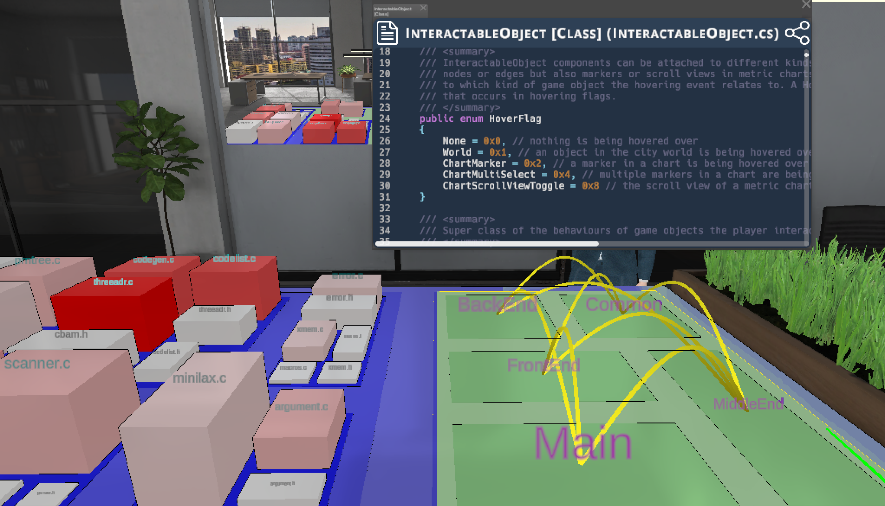

# SEE (Software Engineering Experience)

SEE visualizes hierarchical dependency graphs of software in 3D/VR based on the city metaphor.
The underlying game engine is Unity 3D (version 6000.0.67f1).

> [!NOTE]
> This repository contains only our own code. SEE is using multiple plug-ins, some of which require a commercial license. You will not be able to compile and run our code without these.

Downloadable releases for Windows and Linux are available on the [releases page](https://github.com/uni-bremen-agst/SEE/releases).
